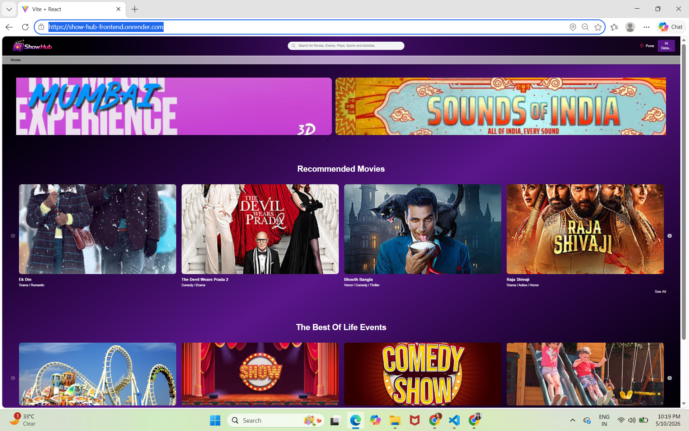
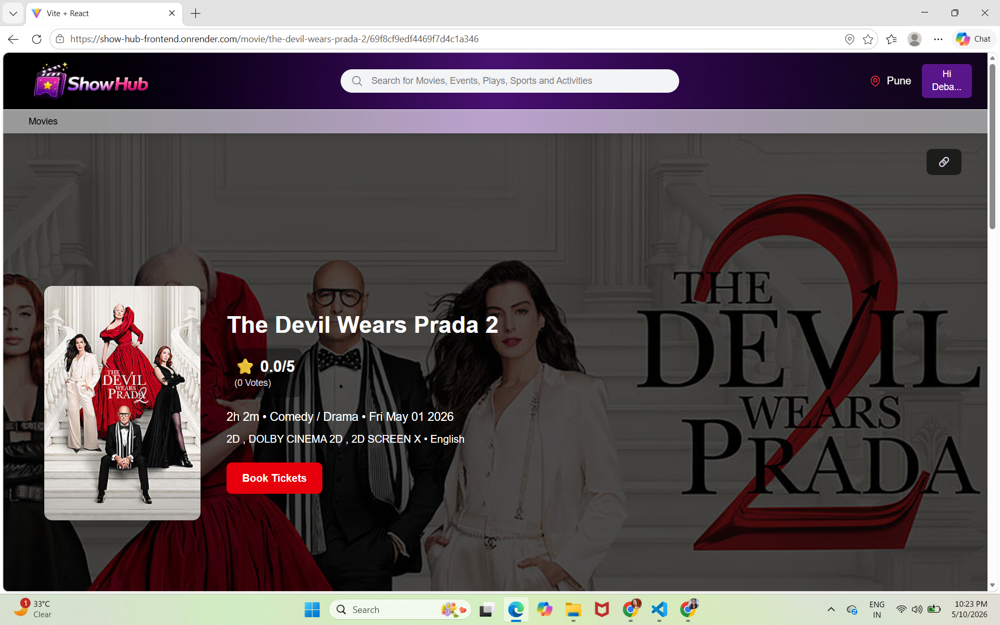
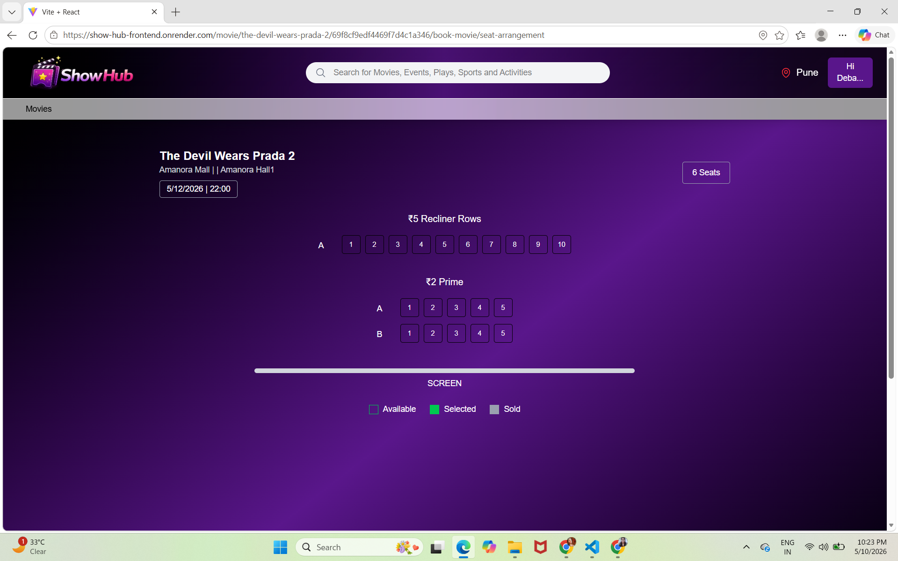
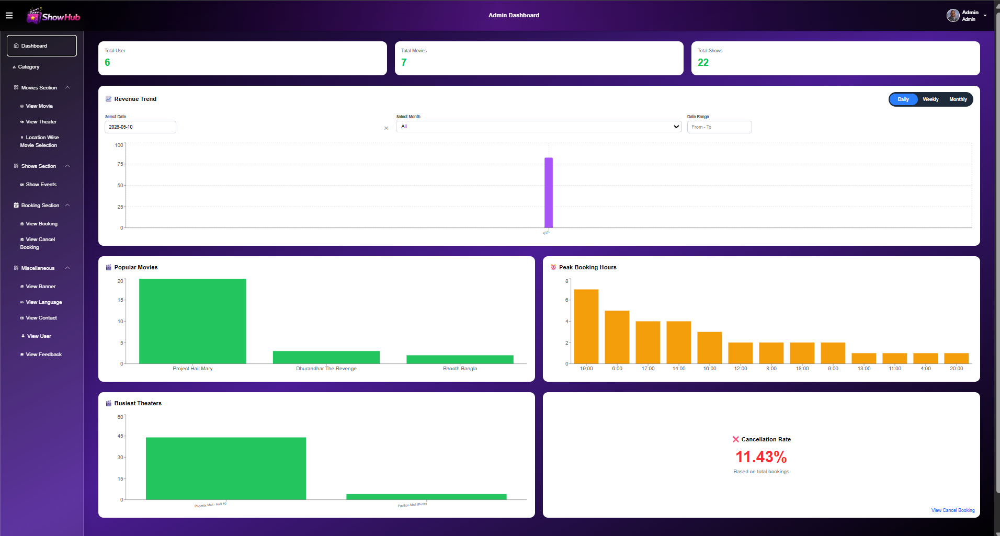
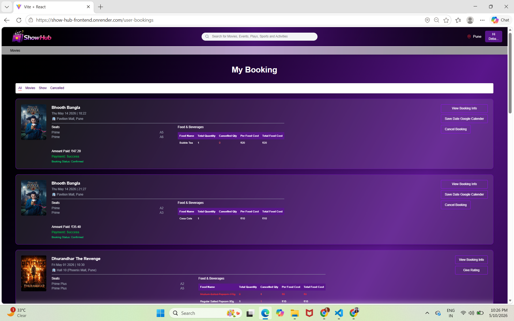

# 🎬 ShowHub – Movie & Event Booking Platform

ShowHub is a **production-level full-stack movie and event booking platform** built using the MERN stack.  
It enables users to explore movies and events, book tickets seamlessly, manage bookings, and enjoy real-time interactive features with a modern responsive interface.

---

## 🚀 Features

- 🔍 Search movies, events, plays, sports & activities
- 📍 Location-based movie recommendations
- 🎟️ Smart seat booking interface
- 👤 Secure Authentication (Login / Signup / Google Signup)
- 🧾 Booking history & profile management
- ⭐ Testimonials & feedback system
- 📱 Fully Responsive Design
- 🎨 Modern UI with Tailwind CSS

---

# 🛠 Tech Stack

## Frontend
- React.js
- Tailwind CSS
- Axios
- React Router

## Backend
- Node.js
- Express.js

## Database
- MongoDB (Mongoose)

## Authentication
- JWT Authentication
- Google OAuth
- OTP Verification

## Payments & Services
- Razorpay
- SendGrid Email Service
- Google Calendar API

---

# 🚀 Advanced Features

- 🔐 Google OAuth + OTP Verification
- 📧 Automated Booking Confirmation Emails with PDF Invoice
- ❌ Partial Seat/Food Cancellation with Refund Notification
- 📅 Google Calendar Integration
- ⭐ Post-show Rating & Review System
- 🎞 Dynamic Banner Management
- 💳 Razorpay Payment Gateway Integration
- 🔒 2-Minute Atomic Seat Locking System
- 📊 Advanced Admin Analytics Dashboard
- 🎬 Secure YouTube Trailer Embedding
- ⚡ Scalable Filtering with MongoDB Indexing
- 👥 User Monitoring & Management

---

# 🏗 System Architecture

ShowHub follows a **Client-Server Architecture**

```plaintext
Frontend (React)
    ↓
API Requests
    ↓
Backend (Node + Express)
    ↓
Business Logic Processing
    ↓
MongoDB Database
    ↓
Response Rendering
```

### Flow

1. User Interaction
2. API Validation
3. Business Logic Processing
4. Database CRUD Operations
5. Real-time Response Rendering

---

# 🗄 Database Collections

- Users
- Movies
- Shows
- Bookings
- Theaters
- Seat Locks
- Reviews
- Refund Payments
- Categories
- Languages
- Banners
- Location-wise Movie Selection

---

# 🔐 Security Measures

- JWT Authentication
- Password Hashing with bcrypt
- OTP Verification
- Protected Admin Routes
- Secure Payment Verification
- Input Validation & Sanitization
- Atomic Seat Lock Transactions
- Secure Webhook Validation

---

# 🛠 Admin Dashboard Features

- Movie CRUD Operations
- Theater Management
- Show Scheduling
- Banner Management
- User Monitoring
- Revenue Analytics
- Booking Reports
- Location-wise Movie Assignment
- Feedback & Contact Management

---

# ⚡ Performance Optimizations

- MongoDB Indexed Queries
- Lazy-loaded Trailers
- Server-side Pagination
- Optimized Image Rendering
- Async Email Queue Processing
- Efficient Filtering Logic

---

# 📚 Key Learnings

Through ShowHub, I gained hands-on experience in:

- Full-stack MERN Development
- Authentication & Authorization
- Payment Gateway Integration
- Concurrent Booking Handling
- Scalable Database Design
- Real-world Deployment Architecture
- Enterprise-grade Security Practices

---

# 🔑 Demo Credentials

## Admin Access

**Email:** admin@gmail.com  
**Password:** admin

---

# ⚙ Installation & Setup

## 1. Clone Repository

```bash
git clone https://github.com/Debadrita-rgb/showhub.git
cd showhub
```

---

## 2. Install Frontend

```bash
cd frontend
npm install
npm run dev
```

---

## 3. Install Backend

```bash
cd backend
npm install
nodemon server.js
```

---

# 🔑 Environment Variables

Create `.env` inside backend folder

```env
PORT=5000
MONGO_URI=your_mongodb_connection_string
JWT_SECRET=your_secret_key

EMAIL_USER=your_email
EMAIL_PASS=your_email_password

RAZORPAY_KEY_ID=your_key
RAZORPAY_SECRET=your_secret

GOOGLE_CLIENT_ID=your_google_client_id
SENDGRID_API_KEY=your_sendgrid_key
```

# 📸 Screenshots

## Home Page


## Movie Details


## Seat Booking


## Admin Dashboard


## Booking Details


---

# ✨ Future Enhancements

- 🤖 AI-based Personalized Recommendations
- 🔄 WebSocket Live Seat Updates
- 📱 Mobile App (React Native)
- 🎁 Loyalty Reward System
- 🌍 Multi-language Support
- 🎟 Coupon & Offer Engine

---

# 👨‍💻 Author

## Debadrita Paul

GitHub:  
https://github.com/Debadrita-rgb

---

# 📜 License

This project is licensed under the **MIT License**

---

# 💡 Inspiration

Inspired by **BookMyShow**, ShowHub aims to deliver a scalable, secure, and modern booking experience while solving real-world challenges like concurrent booking conflicts, seat locking, secure payments, and responsive performance.

---

⭐ If you like this project, give it a star on GitHub!
